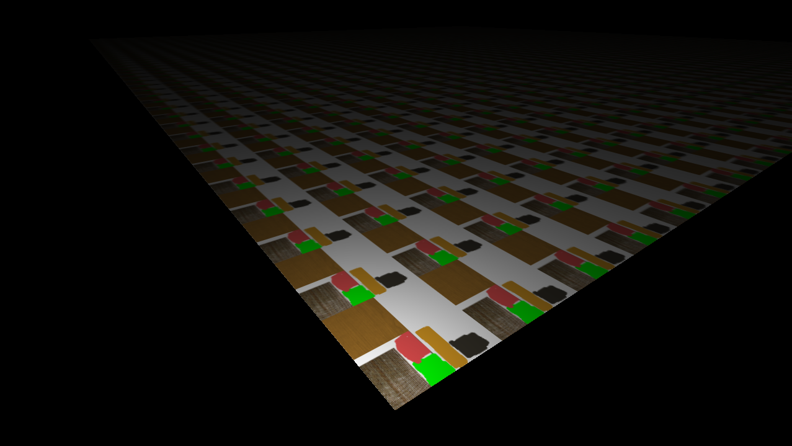
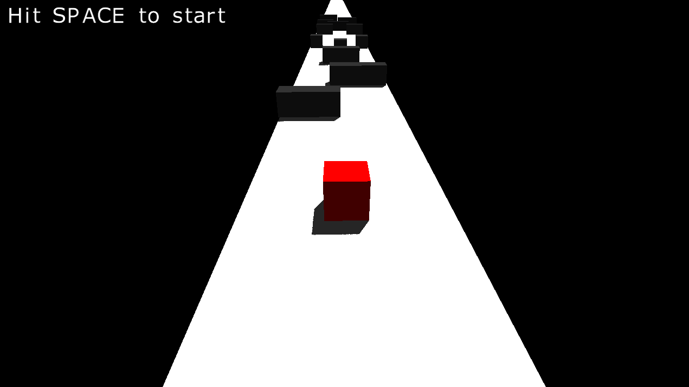
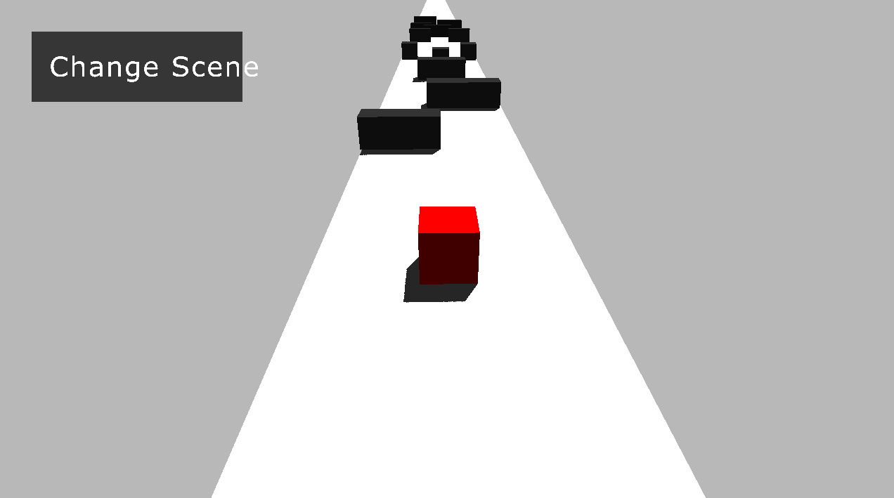

# Instructions

- Clone the repo
- All the required files are already included in "res" folder
- Go to src and run "Main"

## About the project

This is a really simple game. And yes, it's "brackeys beginner game" ripoff

### Features

1. Lighting (diffuse and specular)
2. Model loading (using assimp)
3. Ability to save or load games
4. Shadows

## Some Screenshots

### This is how the game looks

    1. Iteration one
    

    2. Iteration two
    

    3. Iteration three
    

